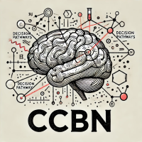

# Welcome to the Bonacchi Lab

<!--  -->

The **Computational, Cognitive, and Behavioral Neuroscience Lab (CCBN)** investigates the neural basis of behavior, cognition, and decision-making through innovative experimental techniques, computational modeling, and theory. Led by Assistant Professor Niccolò Bonacchi, our interdisciplinary work bridges animal and human neuroscience, emphasizing large-scale neural dynamics, temporal processing, brain states, and decision-making.

## Our Mission

We aim to understand how the brain processes information, adapts to new contexts, and generates behavior. By combining behavioral experiments, computational modeling, electrophysiology, and machine learning, we strive to offer mechanistic explanations for cognitive processes and develop open tools and data frameworks for neuroscience research. A significant aspect of our mission includes advocating for open science, reproducibility, and data-sharing practices within the neuroscience community.

## Research Focus

Our main research interests include:

- Neural circuits underlying perception, decision-making, and learning
- Development of novel tools for neuroscience research
- Machine learning applications for neural and behavioral data
- Multispecies comparative neuroscience (animal and human studies)
- Open-science practices, neuroinformatics, and reproducible research

## Latest News

!!! info "Latest Updates"
    - [March 2025] S4SN abstract submission opens!
    - [February 2025] S4SN registration and symposium proposals opens!
    - [January 2025] COGITATE iEEG data paper accepted in *Nature Scientific Data*!!
    - [January 2025] S4SN2025 website running!
    - [December 2024] COGITATE paper accepted in *Nature*!!
    - [December 2024] COGITATE datasets raw and BIDS data for all modalities get their own registered DOI (c/o the [Publications](../publications) page)

## Join Us

We are actively seeking talented and motivated students interested in interdisciplinary neuroscience research. Specific qualifications include:

- Basic programming and data analysis skills (Python, MATLAB, or R)
- Strong motivation for neuroscience research and innovation
- Willingness to collaborate effectively in interdisciplinary team settings

Visit our [Join Us](join.md) page for more details and current opportunities.

## Contact

Located at:
William James Center for Research (WJCR)  
Ispa - Instituto Universitário,  
Rua Jardim do Tabaco, 34,  
1149-041  
Lisbon, Portugal  

[Contact us](contact.md) for collaborations or inquiries.
