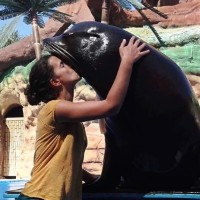
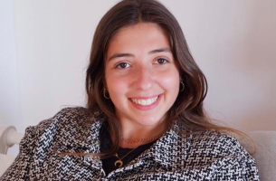
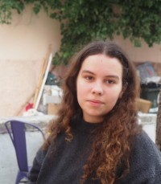

# Team

## Principal Investigator

### Dr. Niccolò Bonacchi

Principal Investigator  
Assistant Professor of Biology and Neuroscience  
[Email ](mailto:nbonacchi@ispa.pt) |
[Google Scholar ](https://scholar.google.com/citations?user=ii0Eww0AAAAJ&hl=en) |
[GitHub ](https://github.com/BonacchiLab) |
[CienciaVitae ](https://www.cienciavitae.pt/portal/en/0612-705C-8295) |
[ORCID ](https://orcid.org/0000-0001-5228-6918) |
[Research Gate ](https://www.researchgate.net/profile/Niccolo-Bonacchi-3) | [Scopus ](https://www.scopus.com/authid/detail.uri?authorId=56598047300) |
[Twitter ](https://twitter.com/nbonacchi) |
[SemanticScholar ](https://www.semanticscholar.org/author/Niccol%C3%B2-Bonacchi/3401977)

#### About Niccolò Bonacchi

Niccolò Bonacchi is an Assistant Professor at ISPA - Instituto Universitário, where he teaches graduate courses in experimental programming and neurobiology. His professional highlights include:

- Ph.D. in Neuroscience (Nova University of Lisbon, CCU), focused on neural representation of spatial objectives, olfactory cues, and predictive coding
- Development and contribution to [Bonsai-RX](https://bonsai-rx.org/), an open-source visual programming language extensively used for behavioral and neuroscience research
- Former Data Architect at the [International Brain Laboratory (IBL)](https://www.internationalbrainlab.com/), leading the development of experimental data acquisition and management systems
- Data Architect of the [COGITATE consortium](https://www.arc-cogitate.com/), developing standards for experimental metadata ontology and promoting FAIR data-sharing practices

Niccolò's research interests lie at the intersection of cognitive and behavioral neuroscience and computational methodologies, emphasizing accurate behavioral quantification, data analysis precision, and open science.

## Graduate Students

### Miriam Oliveira Leal (DVM)

PhD Student - Behavioral Biology  
[LinkedIn](https://www.linkedin.com/in/miriam-leal-72157666/) |
[ORCID](https://orcid.org/0009-0008-7856-5606)

Research focus: Multidimensional pain assessment in seals and sea lions

## Master's Students

### Beatriz Simões

Master's Student - Cognitive and Behavioral Neuroscience  
[LinkedIn](https://www.linkedin.com/in/beatrizcoelhosimoes/)

Research focus: Political decision-making

#### About Beatriz Simões

Beatriz is a Master student of the Behavioral and Cognitive Neuroscience Masters course at Ispa - Instituto Universitário. Beatriz holds an undergraduate course in Political Science by ISCSP - University of Lisbon and is currently a political advisor for education and science for the Social Democratic Party’s Parliamentary Group, that supports the current government. Before that she was a research intern at ITQB Nova, in the Proteomics of Non-Model Organisms Lab, where she employed an array of biochemistry methodologies, such as flow cytometry and fluorescence microscopy. Her scientific interests entail different levels of analysis, by applying an interdisciplinary focus to understand behavioral phenomena. With a background in cellular biology research and an undergraduate course in PolSci, the work she develops in the Master thesis bridges two areas of knowledge concerning political decision making and its neural correlates. She has published 2 articles in peer reviewed journals as co-author.

### Isabel Gaspar

Master's Student - Cognitive and Behavioral Neuroscience  
[LinkedIn](https://www.linkedin.com/in/isabel-gaspar-38aa91187/)

Research focus: Endocrine markers of sea lion well-being

## Undergraduate and Rotational Students

### Carlota Carreiras

Undergraduate Student - Biology  
[Email]()

Research focus: Cogitate dataset fMRI analysis, neural correlates of attention  
_Explorar os mecanismos neuronais da atenção através de dados de fMRI_  
A atenção é uma componente central da nossa experiência consciente — permite-nos focar em estímulos relevantes e ignorar distrações, sendo fundamental para a aprendizagem e para a tomada de decisões. Este projeto surge como uma extensão de um estudo
colaborativo sobre consciência, desenvolvido por diversos centros de investigação. O estudo original gerou um conjunto vasto de dados, sendo um deles dados de neuroimagem funcional (fMRI), com potencial para aprofundar diferentes dimensões da cognição. O foco deste projeto é a análise dos dados de neuroimagem funcional (fMRI) com o objetivo de compreender melhor os mecanismos cerebrais associados à atenção seletiva e à atenção sustentada. Através de técnicas de pré-processamento e análise de imagens fMRI, procuramos identificar padrões de atividade neuronal que ajudam a distinguir entre diferentes tipos de atenção e o seu papel. Este trabalho contribui para perceber e compreender melhor os mecanismos da atenção seletiva e da atenção sustentada, assim como explorar a forma como estas duas dimensões da atenção interagem entre si.

### Maria Moreira

Rotational  Student - Psychology  
[Email]()

Research focus: Facial expression analysis - PyFEAT wrapper and default analysis development

#### About Maria Moreira

Currently developing a pipeline that will be able to accept image and video files and print out emotional tracking metrics. This project aims to build a robust system capable of ingesting visual media and analyzing it to extract emotional cues, such as facial recognition and facial expressions. In addition to the core functionality, the project will include visualizations to interpret the outputs and descriptive statistics from the main data.

### Hugo Almeida

Rotational Student - Psychology  
[Email]()

Research focus: Decision-making task development - Human IBL

#### About Hugo Almeida

Development of a human-adapted version of the International Brain Laboratory’s standardized rodent decision-making task, which examines how mice integrate sensory information (visual contrast) with learned probabilistic priors (block-wise shifts in stimulus location probability). The paradigm examines fundamental cognitive aspects including perceptual discrimination, dynamic belief updating, and history-dependent biases to reveal how uncertainty and prior experience shape choices.
<!-- ## Alumni

### Past Members -->
