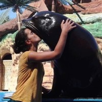
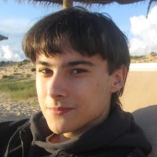
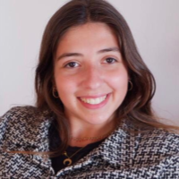
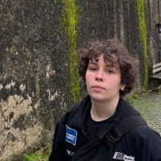

# Team

## Principal Investigator

### Dr. Niccolò Bonacchi

Principal Investigator  
Assistant Professor of Biology and Neuroscience  
[Email ](mailto:nbonacchi@ispa.pt) |
[Google Scholar ](https://scholar.google.com/citations?user=ii0Eww0AAAAJ&hl=en) |
[GitHub ](https://github.com/BonacchiLab) |
[CienciaVitae ](https://www.cienciavitae.pt/portal/en/0612-705C-8295) |
[ORCID ](https://orcid.org/0000-0001-5228-6918) |
[Research Gate ](https://www.researchgate.net/profile/Niccolo-Bonacchi-3) |
[Scopus ](https://www.scopus.com/authid/detail.uri?authorId=56598047300) |
[Twitter ](https://twitter.com/nbonacchi) |
[SemanticScholar ](https://www.semanticscholar.org/author/Niccol%C3%B2-Bonacchi/3401977)

#### About Niccolò Bonacchi

Niccolò Bonacchi is an Assistant Professor at ISPA - Instituto Universitário, where he teaches graduate courses in experimental programming and neurobiology. His professional highlights include:

- Ph.D. in Neuroscience (Nova University of Lisbon | ITQB), developed at the Champalimaud Center for the Unknown (CCU), focused on neural representation of spatial objectives, olfactory cues, and predictive coding
- Development and contribution to [Bonsai-RX](https://bonsai-rx.org/), an open-source visual programming language extensively used for behavioral and neuroscience research
- Data Architect at the [International Brain Laboratory (IBL)](https://www.internationalbrainlab.com/), leading the development of experimental data acquisition and management systems
- Data Architect of the [COGITATE consortium](https://www.arc-cogitate.com/), developing standards for experimental metadata ontology and promoting FAIR data-sharing practices

Niccolò's research interests lie at the intersection of cognitive, behavioral, and computational neuroscience, emphasizing precise behavioral quantification, data analysis, and open science.

## Graduate Students

### Miriam Oliveira Leal (DVM)

PhD Student - Behavioral Biology  
[LinkedIn](https://www.linkedin.com/in/miriam-leal-72157666/) |
[ORCID](https://orcid.org/0009-0008-7856-5606)

Research focus: Multidimensional pain assessment in pinnipeds (seals and sea lions)

## **_Master's Students_**

### Beatriz Simões

Master's Student - Cognitive and Behavioral Neuroscience  
[LinkedIn](https://www.linkedin.com/in/beatrizcoelhosimoes/)

Research focus: Political decision-making

Beatriz is a Master student of the Behavioral and Cognitive Neuroscience Masters course at Ispa - Instituto Universitário. Beatriz holds an undergraduate course in Political Science by ISCSP - University of Lisbon and is currently a political advisor for education and science for the Social Democratic Party’s Parliamentary Group, that supports the current government. Before that she was a research intern at ITQB Nova, in the Proteomics of Non-Model Organisms Lab, where she employed an array of biochemistry methodologies, such as flow cytometry and fluorescence microscopy. Her scientific interests entail different levels of analysis, by applying an interdisciplinary focus to understand behavioral phenomena. With a background in cellular biology research and an undergraduate course in PolSci, the work she develops in the Master thesis bridges two areas of knowledge concerning political decision making and its neural correlates. She has published 2 articles in peer reviewed journals as co-author.

### Isabel Gaspar

Master's Student - Cognitive and Behavioral Neuroscience  
[LinkedIn](https://www.linkedin.com/in/isabel-gaspar-38aa91187/)

Research focus: Endocrine markers of pinniped (seals and sea lions) well-being

### Tomás Maçarico

Master's Student - Cognitive and Behavioral Neuroscience  
<!-- [LinkedIn](https://www.linkedin.com/in/isabel-gaspar-38aa91187/) -->

Research focus: Neural dynamics of visual categories: Social, functional, and symbolic stimuli of the COGITATE MEEG dataset.

Tomás is a Master’s student in Cognitive and Behavioral Neuroscience. His thesis project investigates whether different categories of visual stimuli evoke distinct conscious representations in the human brain. Building on the Cogitate project (Adversarial testing of global neuronal workspace and integrated information theories of consciousness, Nature, 2024), he focuses on comparing faces and letters, analysing MEG data to explore differences in spatial and temporal neural dynamics, as well as connectivity profiles. This research aims to clarify whether conscious perception is category-independent or whether biologically meaningful stimuli, such as faces, are represented with greater stability and integration across brain networks.

## _**Undergraduate and Rotational Students**_

### Tomás Rocha

Undergraduate Student - Psychology

Research focus: Decision-making task development - Human IBL

Tomás's interests encompass memory (pathological and normative memory degradation), research into understanding the autism spectrum and all its diverse particularities, evolutionary psychology, and the influence of genes on the human nervous system and, consequently, on human behavior.

## **_Alumni_**

### Carlota Carreiras

Undergraduate Student - Biology  
Research focus: Cogitate dataset fMRI analysis, neural correlates of attention  
Joined the Masters in Cognitive and Behavioral Neuroscience at Ispa - Instituto Universitário

### Maria Moreira

Rotational  Student - Psychology  
Research focus: Facial expression analysis - PyFEAT wrapper and default analysis development
Joined the Masters in Cognitive and Behavioral Neuroscience at Ispa - Instituto Universitário

### Hugo Almeida

Rotational Student - Psychology  
Research focus: Decision-making task development - Human IBL

<!-- ### Past Members -->
